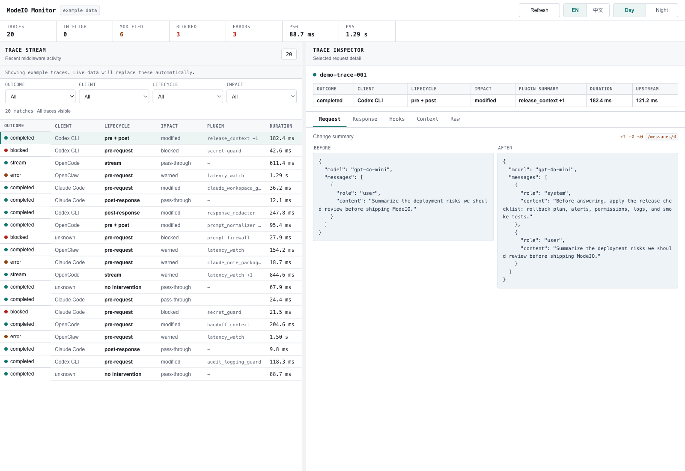

# modeio-middleware

`modeio-middleware` is a local AI gateway for policy, plugins, and live observability.

Put it between agent clients and your upstream model provider to inspect traffic, enforce local policy, run external plugins, and open a built-in monitoring dashboard without rewriting the clients your team already uses.



Built-in monitor with live traces, filters, before/after payload inspection, hook activity, and operator-friendly detail views.

## Why teams use it

- Drop in a local control layer in front of model traffic without changing client workflows
- Keep provider-compatible routes for chat and responses APIs
- See what the middleware actually did through a built-in browser dashboard
- Support Claude Code with a native hook connector
- Extend behavior with external `stdio-jsonrpc` plugins instead of patching core code
- Run locally for demos, operator workflows, safety experiments, and team rollouts

## What you get

- `OpenAI-compatible gateway`: route supported clients through a familiar `/v1` surface
- `Built-in observability`: inspect live traces, before/after payloads, block events, errors, and hook activity in the browser
- `Plugin platform`: author, validate, and conformance-test external plugins with a stable contract
- `Local-first operations`: keep policy logic and monitoring close to where the agents run

## Supported clients

Middleware expects an already-working harness and reuses that harness's own auth. It does not log you in, choose a different provider for you, or fall back to a different auth path if your current client setup is unsupported.

| Client | Status |
| --- | --- |
| `Codex CLI` | ✅ Supported |
| `Claude Code` | ✅ Supported |
| `OpenCode` | ⚠️ Partially supported |
| `OpenClaw` | ⚠️ Partially supported |

More detail:

- `Codex CLI`: works with Codex's normal native auth.
- `Claude Code`: works with Claude's normal native auth.
- `OpenCode`: works today for normal API-key or proxy-style providers that use a standard provider API endpoint.
- `OpenCode`: does not work yet for built-in `openai` with ChatGPT OAuth.
- `OpenCode`: does not work yet for built-in `anthropic` with subscription OAuth.
- `OpenClaw`: works today for normal OpenAI-compatible and Anthropic-compatible providers.
- `OpenClaw`: does not work yet for OpenClaw's built-in Codex or ChatGPT-style provider path.

Deferred compatibility:

- Compatibility work is intentionally paused at the matrix above for now.
- The next planned OpenCode items are built-in `openai` with ChatGPT OAuth, built-in `anthropic` with subscription OAuth, and Anthropic-compatible provider paths such as `zenmux`.
- The next planned OpenClaw item is the built-in Codex or ChatGPT-style provider path.

## Public surface

Traffic routes:

- `POST /v1/chat/completions`
- `POST /v1/responses`
- `POST /connectors/claude/hooks`

Monitoring and ops routes:

- `GET /healthz`
- `GET /modeio/dashboard`
- `GET /modeio/api/v1/events`
- `GET /modeio/api/v1/events/{request_id}`
- `GET /modeio/api/v1/stats`
- `GET /modeio/api/v1/events/live`

Admin routes:

- `GET /modeio/admin/v1/plugins`
- `PUT /modeio/admin/v1/profiles/{profile}/plugins`

## Install

From GitHub:

```bash
python -m pip install git+https://github.com/mode-io/mode-io-middleware
```

From a local checkout:

```bash
python -m pip install .
```

## Quick start

1. Start the gateway:

```bash
modeio-middleware-gateway \
  --host 127.0.0.1 \
  --port 8787 \
  --upstream-chat-url "https://api.openai.com/v1/chat/completions" \
  --upstream-responses-url "https://api.openai.com/v1/responses"
```

Source-checkout maintainers should prefer the repo-local wrapper instead of the installed entrypoint:

```bash
python scripts/dev_gateway.py --fresh
```

That flow keeps dev config and discovered plugins under `./.modeio-dev/` instead of `~/.config/modeio/`, so local review stays isolated from your normal user runtime.

2. Route supported clients through it:

```bash
export OPENAI_BASE_URL="http://127.0.0.1:8787/v1"
modeio-middleware-setup --apply-opencode
modeio-middleware-setup --apply-openclaw
modeio-middleware-setup --apply-claude --create-claude-settings
```

From a source checkout, prefer the repo-local Python helpers instead of editable console scripts:

```bash
export OPENAI_BASE_URL="http://127.0.0.1:8787/v1"
python scripts/setup_middleware_gateway.py --apply-opencode
python scripts/setup_middleware_gateway.py --apply-openclaw
python scripts/setup_middleware_gateway.py --apply-claude --create-claude-settings
```

3. Verify health and open the dashboard:

```bash
modeio-middleware-setup --health-check --json
curl -s http://127.0.0.1:8787/healthz
open http://127.0.0.1:8787/modeio/dashboard
```

4. Send one request through the middleware:

```bash
curl -i http://127.0.0.1:8787/v1/chat/completions \
  -H "Content-Type: application/json" \
  -d '{
    "model": "gpt-4o-mini",
    "messages": [
      {"role": "user", "content": "hello"}
    ],
    "modeio": {
      "profile": "dev"
    }
  }'
```

The dashboard will update as traces arrive. If there is no live traffic yet, it shows example traces so the UI is still explorable during onboarding and verification.

## Monitoring dashboard

The dashboard is served directly by the gateway at `http://127.0.0.1:8787/modeio/dashboard`.

It is designed for day-to-day operators and troubleshooting workflows. Out of the box you can:

- watch the live request stream in a browser
- inspect request and response bodies before and after middleware processing
- see block, error, and latency stats at a glance
- review hook and plugin activity per request
- filter traces by status, source, and endpoint
- switch between English and Chinese, plus day and night themes

If you want raw data or to wire your own tooling around it, use the versioned monitoring APIs under `/modeio/api/v1/*`.

Plugin inventory and mutation live under `/modeio/admin/v1/*`. The gateway keeps admin routes on loopback by default; binding a non-loopback host now requires `--allow-remote-admin`.

For frontend editing, `npm run dev` inside `dashboard/` serves the Vite app on `http://127.0.0.1:4173/modeio/dashboard/` and proxies `/modeio/api/v1/*`, `/modeio/admin/v1/*`, `/v1`, `/connectors/*`, and `/healthz` to `127.0.0.1:8787` by default. That means the canonical gateway still owns the live middleware state while the dev server handles hot-reload UI work.

## Plugin workflow

Scaffold, validate, and conformance-check a public external plugin:

```bash
modeio-middleware-new-plugin my-policy
modeio-middleware-validate-plugin ./plugins_external/my_policy/manifest.json
modeio-middleware-plugin-conformance \
  ./plugins_external/my_policy/manifest.json \
  python3 ./plugins_external/my_policy/plugin.py
```

## Project docs

- Operator guide: `QUICKSTART.md`
- Architecture: `ARCHITECTURE.md`
- External plugin protocol: `MODEIO_PLUGIN_PROTOCOL.md`
- Contributor workflow: `CONTRIBUTING.md`

## Validation

Full repo validation:

```bash
python -m unittest discover tests -p 'test_*.py'
./scripts/smoke_e2e.sh --artifacts-dir ./.artifacts/manual-smoke
./scripts/release_check.sh
```

If you are validating from a source checkout on a repo-local editable install, prefer `python scripts/setup_middleware_gateway.py --doctor --json ...` over the installed `modeio-middleware-setup` entrypoint.

Live routing check against a real upstream:

```bash
./scripts/smoke_e2e.sh --live --artifacts-dir ./.artifacts/live-smoke
```

Live OpenAI-compatible agent smoke now defaults to harness-native auth only: Codex uses the client-scoped gateway route, redirectable OpenCode providers preserve their own provider config, and OpenClaw bridges its current auth/profile through a client-scoped middleware route. Middleware does not provide a managed upstream fallback.

Full agent-matrix smoke is available for local or self-hosted environments where Codex, Claude, OpenCode, and OpenClaw CLIs are installed:

```bash
./scripts/smoke_e2e.sh --live-openai-agents --artifacts-dir ./.artifacts/live-openai-agent-smoke
./scripts/smoke_e2e.sh --live-claude --artifacts-dir ./.artifacts/live-claude-smoke
./scripts/smoke_e2e.sh --live-agents --artifacts-dir ./.artifacts/live-agent-smoke
```

Fresh-install acceptance smoke uses the packaged middleware entrypoints from a temp virtualenv while keeping agent configs in a temp sandbox:

- This path assumes `codex`, `opencode`, `openclaw`, and `claude` are already installed and authenticated on the host.
- Only the middleware under test is freshly installed for the run.

```bash
./scripts/smoke_e2e.sh --live-agents --install-mode wheel --artifacts-dir ./.artifacts/live-agent-acceptance
```
